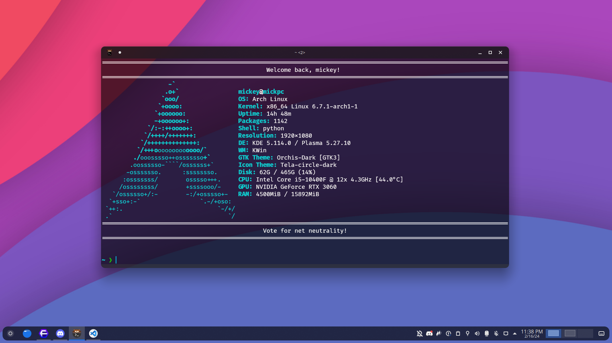

# Hello, shell!
A cool script that adds a cool login-welcome screen everytime you log into your favourite Linux system!

# Preview

## Features
* Supports Python 3.X.X
* Lightweight
* Cool graphics

## Best configuration
* Any Shell
* Ly Greeter
* Kitty emulator (with transparency)
* Any Nerdfont applied

## Installation
Check ***[the wiki](https://mick.gdn/wiki/hello.sh)***
